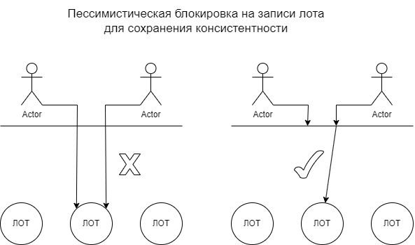

# 🛠 Проект: FuelSeller

## 🔐 **Сервис Авторизации (Authorization)**
Система ролей и учетные данные:

| Роль          | Логин                 | Пароль      |
|--------------|----------------------|------------|
| **Администратор**  | `admin@mail.ru`     | `adminadmin` |
| **Админ + Юзер**  | `adminuser@mail.ru` | `adminuser`  |

---

## 🔗 **Компоненты системы**
1. **EFS (Единая Фронтальная Система)**  
   🔹 Выступает в роли **Gateway** (шлюза)

2. **FuelSeller**  
   🔹 Основной **бэкенд** системы

---

## 📌 **Библиотеки**
1. **AOP**
   🔹 Для кастомных аннотаций
2. **Validation**
3. **Jpa+Postgres**
4. **Flyway**
5. **Swagger**
6. **JWT**
7. **FTP**
8. **Lombok**
9. **Custom Libs**

---

## 📌 **Ссылки**

1. https://hack.noxly.ru/api/swagger-ui/index.html#/ - Сваггер EFS
2. https://auth.noxly.ru/api/swagger-ui/index.html#/ - Сваггер Авторизации
3. https://www.monstaftp.com/demo/ (185.204.2.233, user, 123) - FTP
   🔹 Сюда грузить csv файлы (крон работает раз в минуту, @Sh1bari - чтобы поменять)
4. https://ui.auth.hack.noxly.ru/ - Профиль/SSO
5. https://fuel.hack.noxly.ru/ - Клиентский сайт
6. https://admin.hack.noxly.ru/ - Админский сайт

---

## 📌 **Пометки**

1. BCryptPasswordEncoder не добавил чтобы было легче показывать
2. Клиентский сайт в формате PWA
3. Я единственный бэкендер, не судите строго
4. Docker-compose настроен под Docker Swarm!!!
5. FTP может отвалиться, @Sh1bari - чтобы переподнять

---

 
